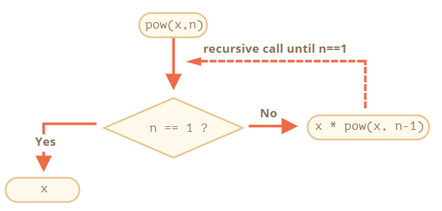

# 6-1. 재귀와 스택

## 1. 재귀란?

: 한 문제(큰 목표)를 해결해야 할 때, 그 문제를 더 작은 경우로 나눠서 작은 문제부터 해결해 나가는 과정을 재귀라고 합니다.

### 1-1. 재귀의 베이스(recursion base)

: 조건에 만족하는 명확한 결괏값을 즉시 도출하여 더 이상 서브 호출을 하지 않게 만들어주는 인수를 말합니다.

### 1-2. 재귀의 단계

: 복잡한 작업은 작은 작업(하위 부서에 대한 반복문)으로 쪼갤 때를 의미합니다.

### 1-3. 재귀의 깊이(recursion depth)

:가장 처음 하는 호출을 포함한 중첩 호출의 최대 개수를 말합니다.

## 2. 재귀 사용의 실행순서 & 장점과 단점

### 2-1. 재귀의 실행순서

1. 스택 최상단에 현재 컨텍스트가 '기록’됩니다.
2. 서브 호출을 위한 새로운 컨텍스트가 만들어집니다.
3. 서브 호출이 완료되면. 기존 컨텍스트를 스택에서 꺼내(pop) 실행을 이어나갑니다.



### 2-2. 장점

- 코드가 간결하고, 코드 이해도가 높아지며, 유지보수가 쉽습니다.

### 2-3 단점

- 재귀는 조건이 맞을 때까지 서브호출된 결과값을 스택(stack)형식으로 쌓아올려 메모리에 저장합니다. 그 결과 저장될 메모리 공간이 필요하기 때문에 메모리 사용으로 부담이 됩니다.

**재귀 이용 예시 코드**

```jsx
function pow(x, n) {
  if (n == 1) {
    return x;
  } else {
    return x * pow(x, n - 1);
  }
}

alert(pow(2, 3)); // 8
```

## 3. 반복문의 장점과 단점

### 3-1. 장점

- 재귀 코드보다는 메모리가 절약되고, 사용 메모리 공간도 고정적입니다.

### 3-2. 단점

- 재귀 코드보다는 길이가 길어 가독성이 떨어지고, 유지보수가 어렵다.
- 조건에 따라 함수가 자신을 서브 호출하고 결과를 합칠 경우 처럼 복잡하게 얽혀있을 때는 메모리가 절약되지 않기 때문에 반복문을 사용할 이유가 없는 경우가 있습니다.

**반복문(for loop) 사용 예시 코드**

```jsx
function pow(x, n) {
  let result = 1;

  // 반복문을 돌면서 x를 n번 곱함
  for (let i = 0; i < n; i++) {
    result *= x;
  }

  return result;
}

alert(pow(2, 3)); // 8
```

✨ **결국은 모든 곳에서 메모리 최적화를 신경 써서 코드를 작성해야 하는 것은 아닙니다. 우리가 필요한 것은 좋은 코드입니다. 이런 이유 때문에 재귀를 사용합니다.**

## 4. 재귀적 구조

: 재귀적으로 정의된 자료구조인 재귀적 자료 구조는 자기 자신의 일부를 복제하는 형태의 자료 구조입니다.

### 4-1. HTML 문서에서 볼 수 있는 재귀적 구조

- 일반 텍스트
- HTML-주석
- 이 외의 *HTML 태그* (이 아래에 일반 텍스트, HTML-주석, 다른 HTML 태그가 올 수 있습니다.)

### 4-2. 연결 리스트

: 객체를 정렬할 때, '배열' 자료구조보다 빠르게 삽입 혹은 삭제할 때 사용할 수 있습니다.

**4-2-1. 연결 리스트의 요소는 객체와 아래 프로퍼티를 조합해서 정의 할 수 있습니다.**

- `value`
- `next`: 다음 *연결 리스트 요소*를 참조하는 프로퍼티. 다음 요소가 없을 땐 `null`이 됩니다.

```jsx
let list = { value: 1 };
list.next = { value: 2 };
list.next.next = { value: 3 };
list.next.next.next = { value: 4 };
list.next.next.next.next = null;
```

- **위 예시 코드를 나눌 때**

```jsx
let secondList = list.next.next;
list.next.next = null;
```


- **합칠 경우**

```jsx
list.next.next = secondList;
```

- **추가할 경우**

```jsx
let list = { value: 1 };
list.next = { value: 2 };
list.next.next = { value: 3 };
list.next.next.next = { value: 4 };

// list에 새로운 value를 추가합니다.
list = { value: "new item", next: list };

// list에서 중간 요소를 제거하면 next를 변경
list.next = list.next.next;
```

# 6-2. 나머지 매개변수와 전개 문법

## 1. 나머지 매개변수 ... (최신문법)

- : 세 개 ...는 "나머지 매개변수들을 한데 모아 배열에 집어넣어라."는 것을 의미합니다.
- 함수의 인수 개수에 제한 없이 전체를 얻어내는 문법

**예시 코드**

```jsx
function showName(firstName, lastName, ...titles) {
  // titles는 배열의 이름입니다.
  alert(firstName + " " + lastName); // Julius Caesar

  // 나머지 인수들은 배열 titles의 요소가 됩니다.
  // titles = ["Consul", "Imperator"]
  alert(titles[0]); // Consul
  alert(titles[1]); // Imperator
  alert(titles.length); // 2
}

showName("Julius", "Caesar", "Consul", "Imperator");
```

### ⚠️ **나머지 매개변수는 항상 마지막에 있어야 합니다.**

```jsx
//나머지 매개변수는 남아있는 인수를 모으는 역할을 하므로 아래 예시에선 에러가 발생합니다.

function f(arg1, ...rest, arg2) { // ...rest 후에 arg2가 있으면 안 됩니다.
  // 에러
}
```

## 2. ‘arguments’ 변수

- arguemnts라는 특별한 유사 배열 객체(array-like object)를 이용하면 인덱스를 사용해 모든 인수에 접근할 수 있습니다.
- 나머지 매개변수 이전에 사용한 오래된 문법입니다.
- 단점은 배열 메서드를 사용할 수 없고, 나머지 매개변수처럼 인수 일부만 사용할 수 없습니다. 이 점을 보완한 문법이 나머지 매개변수 입니다.

**예시코드**

```jsx
function showName() {
  alert(arguments.length);
  alert(arguments[0]);
  alert(arguments[1]);

  // arguments는 이터러블 객체이기 때문에
  // for(let arg of arguments) alert(arg); 를 사용해 인수를 나열할 수 있습니다.
}

// 2, Julius, Caesar가 출력됨
showName("Julius", "Caesar");

// 1, Bora, undefined가 출력됨(두 번째 인수는 없음)
showName("Bora");
```

### ⚠️ 화살표 함수에는 \'arguments\'가 없습니다.

: 화살표 함수에서 arguments 객체에 접근하면, 외부에 있는 ‘일반’ 함수의 arguments 객체를 가져옵니다.

```jsx
function f() {
  let showArg = () => alert(arguments[0]);
  showArg();
}

f(1); // 1
```

## 3. spread 문법(전개 문법)

- 배열을 통째로 매개변수로 넘겨주는 역할을 하기 때문에 나머지 매개변수와 반대 역할을 합니다.
- 이터러블 객체 여러 개를 전달하는 것도 가능합니다.
- 평범한 값을 혼합해 사용 가능합니다.
-

```jsx
let arr1 = [1, -2, 3, 4];
let arr2 = [8, 3, -8, 1];

alert(Math.max(1, ...arr1, 2, ...arr2, 25)); // 25 (전개 문법이 배열을 인수 목록으로 바꿔주었습니다.)
```

- 배열을 할 칠 때, 전개문법을 활용할 수 있습니다.

```jsx
let arr = [3, 5, 1];
let arr2 = [8, 9, 15];

let merged = [0, ...arr, 2, ...arr2];

alert(merged); // 0,3,5,1,2,8,9,15 (0, arr, 2, arr2 순서로 합쳐집니다.)
```

- 전개 문법을 사용해 문자열을 문자 배열로 변환할 수 있습니다.
- 전개 문법은 for..of와 같은 방식으로 내부에서 iterator(반복자)를 사용해 요소를 수집합니다.

```jsx
let str = "Hello";

alert( [...str] ); // H,e,l,l,o

==============================================

// Array.from은 문자열 같은 이터러블 객체를 배열로 바꿔주그 때문에 전개 문법과 동일한 작동 가능.

let str = "Hello";

// Array.from은 이터러블을 배열로 바꿔줍니다.
alert( Array.from(str) ); // H,e,l,l,o
```

### 3-1. 전개 문법과 Array.from의 차이

- `Array.from`은 유사 배열 객체와 이터러블 객체 둘 다에 사용할 수 있습니다.
- 전개 문법은 이터러블 객체에만 사용할 수 있습니다.

이런 이유때문에 무언가를 배열로 바꿀 때는 전개 문법보다 `Array.from`이 보편적으로 사용됩니다.

# 6-3. 변수의 유효범위와 클로저

## 1. 코드 블록

- 코드 블록 {...} 안에서 선언한 변수는 블록 안에서만 사용할 수 있습니다. (if, while, for 문 동일)
- 특정 작업을 수행하는 코드를 한데 묶어두는 용도로 활용할 수 있습니다.
- 같은 이름을 가진 변수를 볼록 없이 선언하면 에러가 발생합니다.

```jsx
{
  // 메시지 출력
  let message = "안녕하세요.";
  alert(message);
}

{
  // 또 다른 메시지 출력
  let message = "안녕히 가세요.";
  alert(message);
}
```

2. 중첩 함수

- 중첩 함수는 함수 내부에서 선언한 함수를 말합니다.
- 코드를 정돈하는데 사용할 수 있습니다.
- 자바스크립트에서 자주 사용됩니다.
- 새로운 객체의 프로퍼티 형태나 중첩 함수 그 자체로 반환될 수 있습니다. 반환된 중첩 함수는 어디서든 호출할 수 있습니다.

```jsx
function makeCounter() {
  let count = 0;

  return function () {
    return count++;
  };
}

let counter = makeCounter();

alert(counter()); // 0
alert(counter()); // 1
alert(counter()); // 2
```


## 3. 렉시컬 환경

- '렉시컬 환경’은 명세서에서 자바스크립트가 어떻게 동작하는지 설명하는 데 쓰이는 ‘이론상의’ 객체입니다. 따라서 코드를 사용해 직접 렉시컬 환경을 얻거나 조작하는 것은 불가능합니다.
- 자바스크립트에선 실행 중인 함수, 코드 블록 {...}, 스크립트 전체는 렉시컬 환경(Lexical Environment) 이라 불리는 내부 숨김 연관 객체(internal hidden associated object)를 갖습니다.
- 렉시컬 환경의 단계는 변수 → 함수 선언문 → 내부와 외부 렉시컬 환경 → 반환함수

3-2. 클로저(closure)

- 외부 변수를 기억하고 이 외부 변수에 접근할 수 있는 함수를 의미합니다.
- 자바스크립트의 함수는 숨김 프로퍼티인 [[Environment]]를 이용해 자신이 어디서 만들어졌는지를 기억합니다. 함수 내부의 코드는 [[Environment]]를 사용해 외부 변수에 접근합니다.

## 4. 가비지 컬렉션

: 가비지 컬렉션이 함수 호출이 끝나면 함수에 대응하는 렉시컬 환경이 메모리에서 제거합니다. 함수와 관련된 변수들은 같이 사라집니다.
