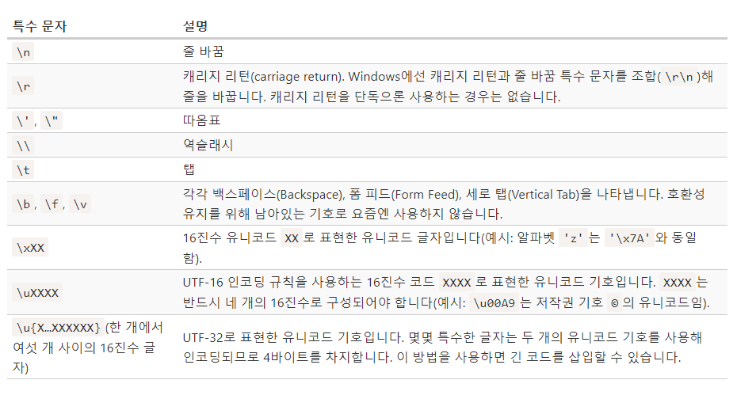

# 5-2. 숫자형

모던 자바스크립트는 숫자를 두 가지 자료형으로 지원한다.

- 일반적인 숫자로 64비트 형식의 '배정밀도 부동소수점 숫자(double precision floating point number)'이다.
- 임의의 길이를 가진 정수는 BigInt 숫자로 나타낼 수 있다.

## 1. 'e' 숫자 표현법

```jsx
let billion = 1e9;  // 10억, 1과 9개의 0
alert( 7.3e9 );  // 73억 (7,300,000,000)

1e3 = 1 * 1000
1.23e6 = 1.23 * 1000000
```

- 0의 개수를 `'e'` 뒤에 추가한다. `123e6`은 0이 6개인 숫자, `123000000`을 나타낸다.

```jsx
let ms = 1e-6; // 1에서 왼쪽으로 6번 소수점 이동

// 10을 세 번 거듭제곱한 수로 나눔
1e-3 = 1 / 1000 (=0.001)

// 10을 여섯 번 거듭제곱한 수로 나눔
1.23e-6 = 1.23 / 1000000 (=0.00000123)
```

- `'e'` 다음에 음수가 오면, 음수의 절댓값 만큼 10을 거듭제곱한 숫자로 주어진 숫자를 나눈다. `123e-6`은 `0.000123`을 나타낸다.

## 2. 16진수 , 2진수 , 8진수

: 색을 나타내거나 문자를 인코딩할 때 등 다양한 곳에 사용된다.(0x를 사용해 표현할 수 있다.)

```jsx
alert(0xff); // 255
alert(0xff); // 255 (대·소문자를 가리지 않으므로 둘 다 같은 값을 나타냅니다.)
```

- 2진수와 8진수는 아주 드물게 쓰이긴 하지만, 접두사 0b와 0o를 사용해 간단히 나타낼 수 있다.

## 3. toString(base)

num.toString(base) 메서드는 base진법으로 num을 표현한 후, 이를 문자형으로 변환해 반환한다.

```jsx
let num = 255;

alert(num.toString(16)); // ff
alert(num.toString(2)); // 11111111
```

base는 2에서 36까지 쓸 수 있는데, 기본값은 10이다.

## 4. parseInt와 parseFloat

: 두 함수는 불가능할 때까지 문자열에서 숫자를 ‘읽는다’.

숫자를 읽는 도중 오류가 발생하면 이미 수집된 숫자를 반환한다. parseInt는 정수, parseFloat는 부동 소수점 숫자를 반환한다.

```jsx
alert(parseInt("100px")); // 100
alert(parseFloat("12.5em")); // 12.5

alert(parseInt("12.3")); // 12, 정수 부분만 반환됩니다.
alert(parseFloat("12.3.4")); // 12.3, 두 번째 점에서 숫자 읽기를 멈춥니다.
```

- parseInt와 parseFloat가 NaN을 반환하는 경우.

```jsx
alert(parseInt("a123")); // NaN, a는 숫자가 아니므로 숫자를 읽는 게 중지됩니다.
```

## 5. 소수를 처리하는 함수 메서드

- **Math.random()**

: 0과 1 사이의 난수를 반환한다(1은 제외).

```jsx
alert(Math.random()); // 0.1234567894322
alert(Math.random()); // 0.5435252343232
alert(Math.random()); // ... (무작위 수)
```

- Math.max(a, b, c...) / Math.min(a, b, c...)

: 인수 중 최대/최솟값을 반환한다.

```jsx
alert(Math.max(3, 5, -10, 0, 1)); // 5
alert(Math.min(1, 2)); // 1
```

- Math.pow(n, power)

: n을 power번 거듭제곱한 값을 반환한다.

```jsx
alert(Math.pow(2, 10)); // 2의 10제곱 = 1024
```

# 5-3. 문자열

자바스크립트에선 UTF-16을 사용해 문자열을 인코딩한다.

## 1. 따옴표

: 자바스크립트에서는 따옴표의 종류가 세 가지이다. 이 중에서 백틱은 문자열을 여러줄에 걸쳐 쓸 수 있다. 사용법은 ${…} 이다.

```jsx
let single = '작은따옴표';
let double = "큰따옴표";

let backticks = `백틱`; // 템플릿 리터럴(template literal)

========================================================
// 템플릿 리터럴 사용범.

function sum(a, b) {
  return a + b;
}

alert(`1 + 2 = ${sum(1, 2)}.`); // 1 + 2 = 3.

let guestList = `손님:
 * John
 * Pete
 * Mary
`;

alert(guestList); // 손님 리스트를 여러 줄에 걸쳐 작성함
```

## 2. 특수 기호

- 모든 특수 문자는 '이스케이프 문자(escape character)'라고도 불리는 역슬래시 (backslash character) \로 시작한다.
- '줄 바꿈 문자(newline character)'라 불리는 특수기호 \n을 사용하면 작은따옴표나 큰따옴표로도 여러 줄 문자열을 만들 수 있다.

```jsx
let str1 = "Hello\nWorld"; // '줄 바꿈 기호'를 사용해 두 줄짜리 문자열을 만듦

// 백틱과 일반적인 줄 바꿈 방법(엔터)을 사용해 두 줄짜리 문자열을 만듦
let str2 = `Hello
World`;

alert(str1 == str2); // true
```



## 3. 특정 글자에 접근하기

- 문자열 내의 글자 하나를 얻으려면 대괄호 `[]`를 사용해야한다.

```jsx
let str = `Hello`;

// 첫 번째 글자
alert(str[0]); // H
alert(str.charAt(0)); // H

// 마지막 글자
alert(str[str.length - 1]); // o
```

for..of를 사용하면 문자열을 구성하는 글자를 대상으로 반복 작업을 할 수 있다.

```jsx
for (let char of "Hello") {
  alert(char); // H,e,l,l,o (char는 순차적으로 H, e, l, l, o가 됩니다.)
}
```

## 4. 대·소문자 변경하기

메서드 toLowerCase()와 toUpperCase()는 대문자를 소문자로, 소문자를 대문자로 변경(케이스 변경)시켜준다.

```jsx
alert("Interface".toUpperCase()); // INTERFACE
alert("Interface".toLowerCase()); // interface

alert("Interface"[0].toLowerCase()); // 'i' (글자 하나만 출력도 가능)
```

## 5. 부분 문자열 추출하기

: 자바스크립트에는 부분 문자열 추출과 관련된 메서드가 총 세 가지 메서드 substring, substr, slice 세 가지 있다.

- **str.slice(start [, end])**

문자열의 `start`부터 `end`까지(`end`는 미포함)를 반환한다.

```jsx
let str = "stringify";
alert(str.slice(0, 5)); // 'strin', 0번째부터 5번째 위치까지(5번째 위치의 글자는 포함하지 않음)
alert(str.slice(0, 1)); // 's', 0번째부터 1번째 위치까지(1번째 위치의 자는 포함하지 않음)
```

- **str.substring(start [, end])**

: `start`와 `end` *사이*에 있는 문자열을 반환한다.

substring은 음수 인수를 허용하지 않는다. 음수는 0으로 처리한다.

- **str.substr(start [, length])**

: `start`에서부터 시작해 `length` 개의 글자를 반환한다.

`substr`은 끝 위치 대신에 길이를 기준으로 문자열을 추출한다.
