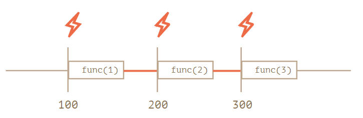
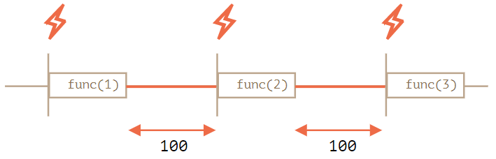

# 6-8. setTimeout과 setInterval을 이용한 호출 스케줄링

## 호출 스케줄링(scheduling a call) 이란?

일정 시간이 지난 후에 원하는 함수를 예약 실행(호출)할 수 있게 하는 것을 말합니다.

## 호출 스케줄링을 구현하는 방법 2가지

- `setTimeout`을 이용해 일정 시간이 지난 후에 함수를 실행하는 방법
- `setInterval`을 이용해 일정 시간 간격을 두고 함수를 실행하는 방법

## 1. setTimeout

- **문법**

```jsx
let timerId = setTimeout(func|code, [delay], [arg1], [arg2], ...
```

- **예시 코드1)**

```jsx
function sayHi() {
  alert("안녕하세요.");
}

setTimeout(sayHi, 1000); // 단위는 밀리초(millisecond, 1000밀리초 = 1초)이며 기본값은 0
```

- **예시 코드 2)**

setTimeout의 첫 번째 인수가 문자열이면 자바스크립트는 이 문자열을 이용해 함수를 만듭니다.(익명 화살표 사용 추천)

```jsx
setTimeout(() => alert("안녕하세요."), 1000);
```

⚠️ **setTimeout에 함수를 넘길 때, 함수 뒤에 () 을 붙이지 않습니다. (setTimeout은 함수의 참조 값을 받도록 정의 됨)**

```jsx
// 잘못된 코드
setTimeout(sayHi(), 1000); // 호출 결과는 undefined
```

# 2. clearTimeout으로 스케줄링 취소하기

### 2-1. **clearTimeout 과 clearInterval의 역할**

- **clearTimeout** - 일정 시간 후 **한번 실행하는 것**을 중지 합니다.
- **clearInterval** - 일정시간마다 **반복하는 것**을 중단합니다.

- **문법**

```jsx
let timerId = setTimeout(...);
clearTimeout(timerId);
```

- **예시 코드**

아래 코드를 실행하면 alert 창이 2개가 뜨는데, 이 얼럿 창을 통해 브라우저 환경에선 타이머 식별자가 숫자라는 걸 알 수 있습니다. **호스트 환경마다 타이머 식별자가 숫자형 이외의 자료형일 수 있습니다.**

```jsx
let timerId = setTimeout(() => alert("아무런 일도 일어나지 않습니다."), 1000);
alert(timerId); // 타이머 식별자

clearTimeout(timerId);
alert(timerId); // 위 타이머 식별자와 동일함 (취소 후에도 식별자의 값은 null이 되지 않습니다.)
```

# 3. setInterval

: setTimeout 함수는 **단 한번만 실행**하는 것과 달리, setInterval 함수는 **주기적으로 실행**됩니다.

- **문법** (setTimeout과 동일한 문법을 사용)

```jsx
let timerId = setInterval(func|code, [delay], [arg1], [arg2], ...)
```

- **예시코드**

```jsx
// 2초 간격으로 메시지를 보여줌
let timerId = setInterval(() => alert("째깍"), 2000);

// 5초 후에 정지
setTimeout(() => {
  clearInterval(timerId);
  alert("정지");
}, 5000);
```

# 4. 중첩 setTimeout

- setInterval, 중첩 setTimeout 2가지를 이용해서 무언가를 일정간격을 두고 실행할 수 있습니다.
- 중첩 setTimeout을 이용하는 방법은 setInterval을 사용하는 방법보다 유연합니다. 호출 결과에 따라 다음 호출을 원하는 방식으로 조정해 스케줄링 할 수 있기 때문입니다.
- **중첩 setTimeout을 이용하는 방법은 지연 간격을 보장하지만 setInterval은 이를 보장하지 않습니다.**
- setInterval은 일정한 시간 간격으로 실행되는 작업이 그 시간 간격보다 오래걸릴 경우 문제가 발생할 수 있습니다.

**1) setinterval 예시코드**

```jsx
let i = 1;
setInterval(function () {
  func(i++);
}, 100);
```



**setInterval을 사용하면 func호출 사이의 지연 간격이 실제 명시한 간격(100ms)보다 짧아집니다!** 이는 func을 실행하는 데 ‘소모되는’ 시간도 지연 간격에 포함시키기 때문입니다.

**2) 중첩 setTimeout**

```jsx
let i = 1;
setTimeout(function run() {
  func(i++);
  setTimeout(run, 100);
}, 100);
```



**중첩 setTimeout을 사용하면 명시한 지연(여기서는 100ms)이 보장됩니다.**

# 5. 대기 시간이 0인 setTimeout

: `setTimeout(func, 0)`이나 `setTimeout(func)`을 사용하면 `setTimeout`의 대기 시간을 0으로 설정할 수 있습니다.

대기 시간을 0으로 설정하면 `func`을 ‘가능한 한’ 빨리 실행할 수 있습니다. 다만, 이때 스케줄러는 현재 실행 중인 스크립트의 처리가 종료된 이후에 스케줄링한 함수를 실행합니다.

## 5-1. 브라우저 환경에서 실제 대기 시간은 0이 아닙니다.

- 브라우저는 HTML5 표준에서 정한 중첩 타이머 실행 간격 관련 제약을 준수합니다. 해당 표준엔 "다섯 번째 중첩 타이머 이후엔 대기 시간을 최소 4밀리초 이상으로 강제해야 한다."라는 제약이 명시되어있습니다.

```jsx
let start = Date.now();
let times = [];

setTimeout(function run() {
  times.push(Date.now() - start); // 이전 호출이 끝난 시점과 현재 호출이 시작된 시점의 시차를 기록

  if (start + 100 < Date.now()) alert(times);
  // 지연 간격이 100ms를 넘어가면, array를 얼럿창에 띄워줌
  else setTimeout(run); // 지연 간격이 100ms를 넘어가지 않으면 재스케줄링함
});

// 출력창 예시:
// 1,1,1,1,9,15,20,24,30,35,40,45,50,55,59,64,70,75,80,85,90,95,100
```

앞쪽 타이머들은 스펙에 적힌 것처럼 지연 없이 바로 실행됩니다. 그런데 다섯 번째 중첩 타이머 이후엔 지연 간격이 4밀리초 이상이 되어 9, 15, 20, 24...와 같은 값이 저장되는 것을 확인할 수 있습니다.

**이런 제약은 setTimeout뿐만 아니라 setInterval에도 적용됩니다. 한편, 서버 측엔 이런 제약이 없습니다. Node.js의 process.nextTick과 setImmediate를 이용하면 비동기 작업을 지연 없이 실행할 수 있습니다. 위에서 언급된 제약은 브라우저에 한정됩니다.**
